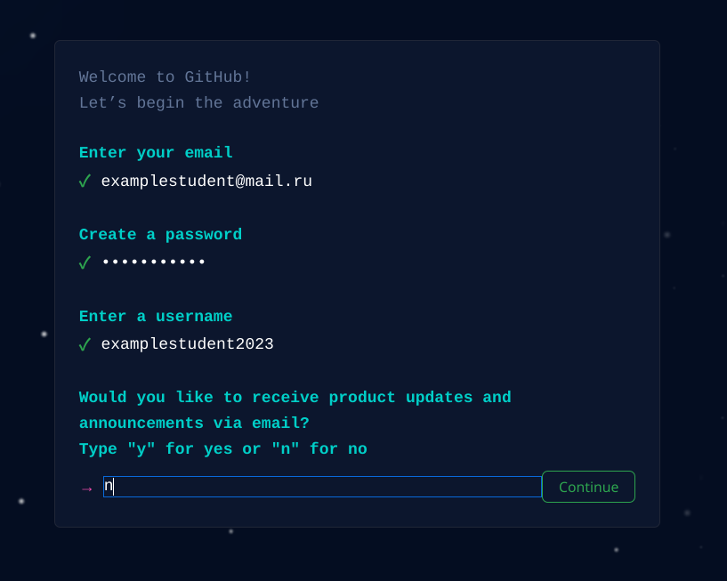
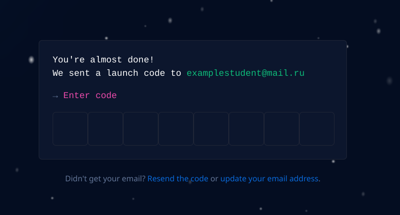
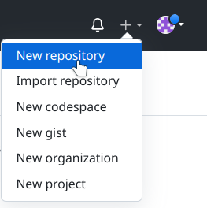
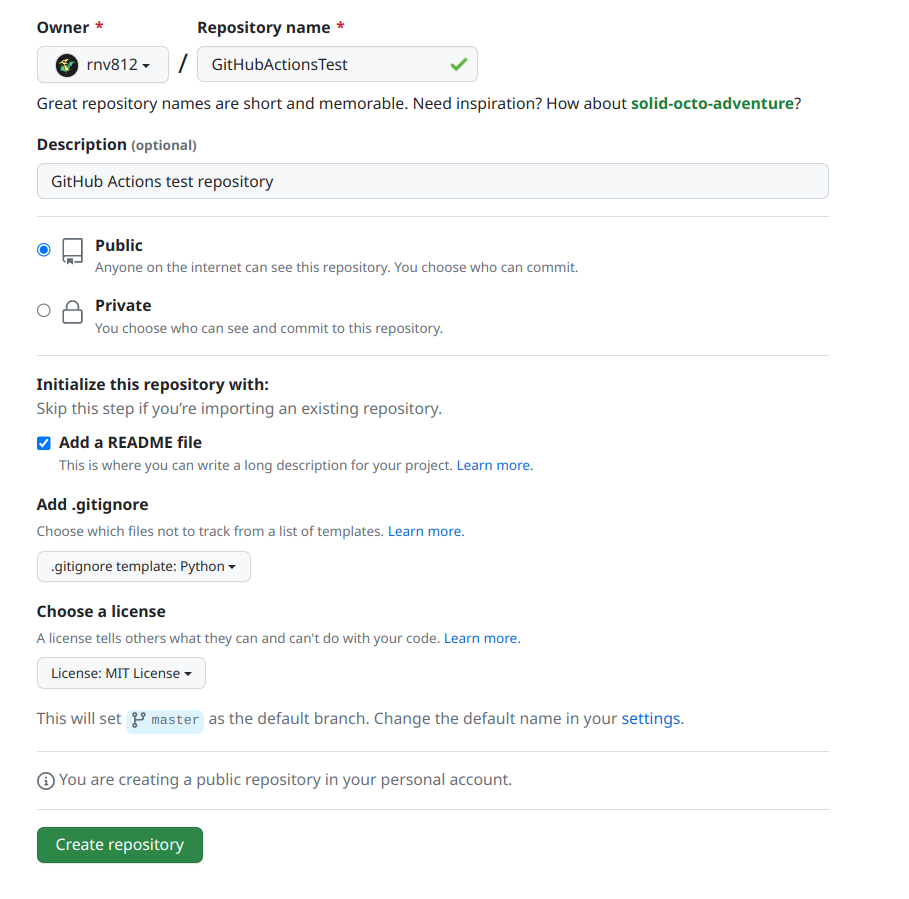
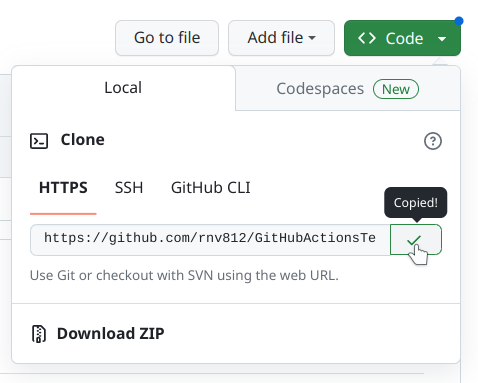
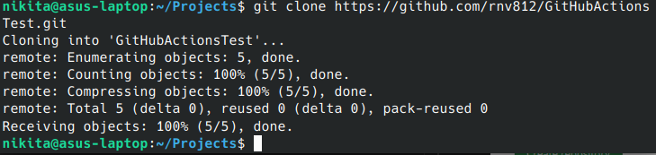
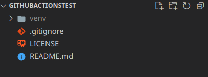
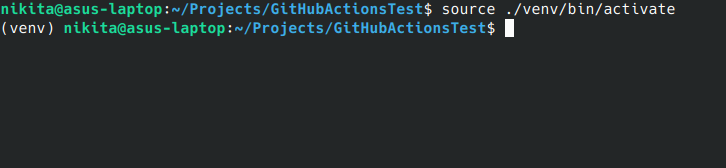
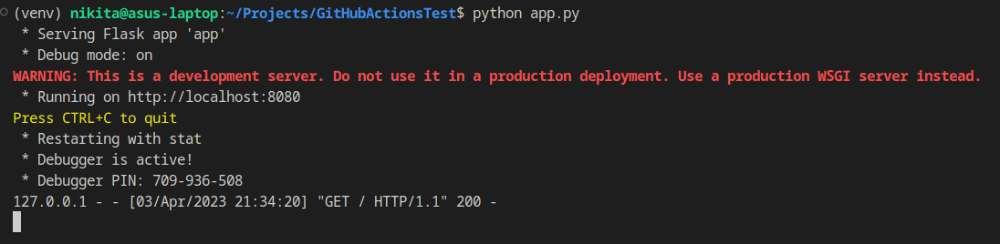
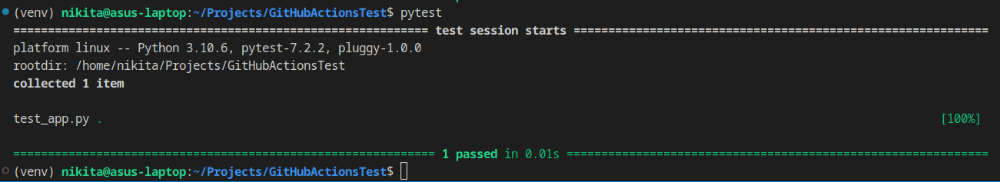

# Лабораторная №2 "Использование GitHub Actions в CI/CD"

## Этап 1. Регистрация аккаунта на GitHub
1.1 Перейдем на [оффициальный сайт GitHub](https://github.com/).

1.2 В правом верхнем углу нажмем кнопку Sign Up (зарегистрироваться).

1.3 Вводим запрашиваемые данные (почта, пароль, имя пользователя). На вопрос хотим ли мы получать рассылку можем ответить `нет` вписав `n` в соответствующее поле.



1.4 Проходим капчу и подтверждаем регистрацию.

1.5 Подтверждаем почту, указав код из пришедшего письма.



## Этап 2. Создание репозитория
2.1 В правом верхнем углу нижмаем на значок `+` и выбираем пункт `New Repository`.



2.2 Даем репозиторю любое имя, также отметим пунк `Add README file`, добавим файл `.gitignore` для Python и выберем лицензию в пункте `Choose license`. После чего подтверждаем создание.

> **Полезно знать**
> Файл `.gitignore` используется системой git для игнорирования указанных файлов и директорий. Обычно игнорируют директории с кэшом проложений, виртуальные окружения и тому подобное что используется только локально, тем самым оставляя на хранении в репозитории только самое необходимое. Другой пример - файлы содержащие учетные данные, такие как ключи, токены и прочее. Они исключаются для того чтобы не попасть на публичное обозрение.



## Этап 3. Клонирование репозитория

3.1 Получим ссылку на репозиторий, нажав на зеленую кнопку `Code` на странице репозитория и скопировав поле с HTTPS адресом.



3.2 Создадим любую директорию в которую будет склонирован репозиторий после чего из этой директории в терминале выполним следующую команду:

```
git clone <link>
```

где вместо `<link>` будет подставлен скопированный адрес репозитория.



## Этап 4. Подготовка окружения
4.1 Внутри склонированного репозитория cоздадим виртуальное окружение при помощи следующей комнды:

_Для пользователей Windows_
```
python -m venv venv
```

_Для пользователей Linux или MacOS_
```
python3 -m venv venv
```

После чего в проекте должна появиться директория `venv`



4.2 Активируем наше виртуальное окружение следующей командой:

_Для пользователей Windows_
```
./venv/Scripts/activate
```

_Для пользователей Linux или MacOS_
```
source ./venv/bin/activate
```



4.3 Установим пакеты `pytest`, `flake8` и `flask` внутри виртуального окружения. Для этого выполним следующие команды:
```
pip install pytest
pip install flake8
pip install flask
```

4.4 Сформируем файл установленных зависимостей используя следующую команду:
```
pip freeze > requirements.txt
```
После выполнения этой команды в дириктории проекта появится файл `reqirements.txt`.

> **Полезно знать**
> Предыдущей командой мы выполнили так называемый пиннинг зависимостей. Теперь в файле находится информация обо всех установленных для нашего виртуального окружения пакетах. Если другой разработчик захочет установить в свое новое пустое виртуальное окружение все необходимые зависимости проекта, то ему достаточно выполнить следующую команду:
> ```
> pip install -r requirements.txt
> ```
> Менеджер пакетов считает из файла все зависимости и установит их в активное вирутальное кружение.

## Этап 5. Создание тестового приложения

5.1 Создадим новый файл `app.py` в котором будет код python приложения.

5.2 Напишем простое веб приложение, которое будет запускаться локально и например бросать игральную кость (генерировать случайное число от 1 до 6).

Для начала напишем основной код сервера:
```py
from flask import Flask, render_template


app = Flask(__name__)

@app.route('/')
def home():
    pass

app.run(host='localhost', port=8080, debug=True)
```

5.3 Создадим файл `utils.py` в котром будут функции которые будет вызывать сервер. Реализуем функцию `roll_the_dice` которая генерирует случайное число от 1 до 6.

```py
from random import randint


def roll_the_dice() -> int:
    """Generate a random number between 1 and 6."""
    return randint(1, 6)

```

5.4 Создадим простой html шаблон для отрисовки страницы. Для этого в проекте создадим директорию `templates` и в ней создадим файл `roll-the-dice.html`. Напишем в нем следующую разметку:


```html
<!DOCTYPE html>
<html>
  <head>
    <meta charset="utf-8">
    <title>Roll the dice</title>
    <style>
      .center {
        margin-left: 30%;
        margin-right: 30%;
        background: #ccc;
        padding: 20px;
        text-align: center;
       }
    </style>
  </head>
  <body>
    <div class="center">
      <h1>Roll the dice</h1>
      <h2>{{ number }}</h2>
      <button onClick="window.location.reload();">Again</button>
    </div>

  </body>
</html>
```

> **Справочная информация**
> Директория `templates/` является одним из стандартных путей поиска шаблонов для flask приложения. Именно поэтому мы поместили шаблон туда.

5.5 Обновим код сервера. импортируем нашу функцию `roll_the_dice` и будем передавать ее возвращаемое значение в шаблон для отрисовки.

```py
from flask import Flask, render_template

from utils import roll_the_dice


app = Flask(__name__)

@app.route('/')
def home():
    return render_template('roll-the-dice.html', number=roll_the_dice())


app.run(host='localhost', port=8080, debug=True)
```

5.6 Выполним запуск сервера при помощи следующей команды:
```
python app.py
```



5.7 В браузере перейдем по адресу `localhost:8080` и увидим наш симулятор бросания кубика.


## Этап 6. Написание тестов
6.1 В дириктории проекта создадим файл `test_app`. Напишем в нем тесты для наших функций, коих у нас пока одна - `roll_the_dice`.

```py
from utils import roll_the_dice


def test_roll_the_dice():
    for _ in range(1, 100):
        assert roll_the_dice() in range(1, 7)
    

```

В данном коде мы проверяем что функция `roll_the_dice` возвращает значения в промежутке от 1 включительно до 7 не включая.

> **Обратите внимание**
> Важно заметить что название тестирующей функции начиная с префикса `test_`. Пакет тестирования `pytest` имеет набор шаблонов для имен функций, которые необходимо считать тестирующими. Именно поэтому мы назвали функцию следующим образом.

6.2 Остановим сервер комбинацией клавиш `Ctrl+C` в терминале из которого его запускали. Запустим тесты выполнив следующую команду:

```
pytest
```



Видим, что `pytest` обнаружил наши тесты, запустил их и вывел результат тестирования. Если хотя бы один из тестов был бы провален, то все тестирование завершилось как непройденное.

## Этап 7. Подключение Actions в репозиторий

