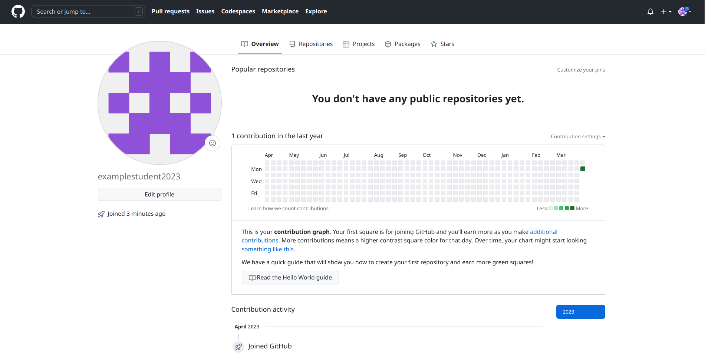

# Лабораторная №2 "Использование GitHub Actions в CI/CD"

## Этап 1. Регистрация аккаунта на GitHub
1.1 Перейдем на [оффициальный сайт GitHub](https://github.com/).

1.2 В правом верхнем углу нажмем кнопку Sign Up (зарегистрироваться).

1.3 Вводим запрашиваемые данные (почта, пароль, имя пользователя). На вопрос хотим ли мы получать рассылку можем ответить "нет" вписав "n" в соответствующее поле.

1.4 Проходим капчу и подтверждаем регистрацию.

1.5 Подтверждаем почту, указав код из пришедшего письма.

1.6 После успешной регистрации переходим в профиль.

## Этап 2. Создание репозитория
2.1 В правом верхнем углу нижмаем на значок "+" и выбираем пункт New Repository (Новый Репозиторий).

2.2 Даем репозиторю любое имя и подтверждаем создание.

