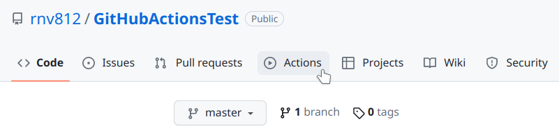
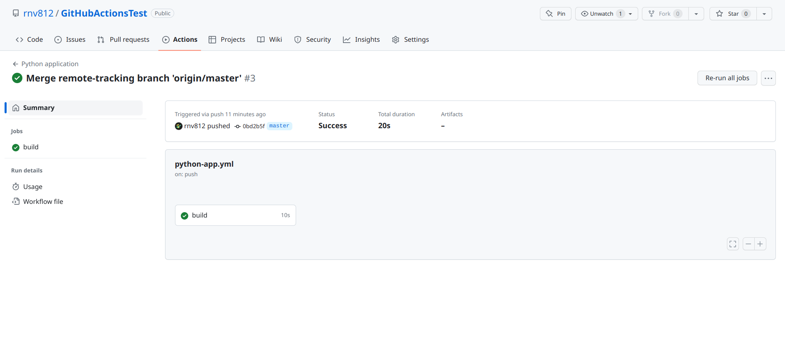

# Лабораторная №2 "Использование GitHub Actions в CI/CD"

## Этап 1. Регистрация аккаунта на GitHub
1.1 Перейдем на [оффициальный сайт GitHub](https://github.com/).

1.2 В правом верхнем углу нажмем кнопку Sign Up (зарегистрироваться).

1.3 Вводим запрашиваемые данные (почта, пароль, имя пользователя). На вопрос хотим ли мы получать рассылку можем ответить `нет` вписав `n` в соответствующее поле.


1.4 Проходим капчу и подтверждаем регистрацию.

1.5 Подтверждаем почту, указав код из пришедшего письма.


## Этап 2. Создание репозитория
2.1 В правом верхнем углу нижмаем на значок `+` и выбираем пункт `New Repository`.


2.2 Даем репозиторю любое имя, также отметим пунк `Add README file`, добавим файл `.gitignore` для Python и выберем лицензию в пункте `Choose license`. После чего подтверждаем создание.

> **Полезно знать**
> Файл `.gitignore` используется системой git для игнорирования указанных файлов и директорий. Обычно игнорируют директории с кэшом проложений, виртуальные окружения и тому подобное что используется только локально, тем самым оставляя на хранении в репозитории только самое необходимое. Другой пример - файлы содержащие учетные данные, такие как ключи, токены и прочее. Они исключаются для того чтобы не попасть на публичное обозрение.


## Этап 3. Клонирование репозитория

3.1 Получим ссылку на репозиторий, нажав на зеленую кнопку `Code` на странице репозитория и скопировав поле с HTTPS адресом.


3.2 Создадим любую директорию в которую будет склонирован репозиторий после чего из этой директории в терминале выполним следующую команду:

```
git clone <link>
```

где вместо `<link>` будет подставлен скопированный адрес репозитория.


## Этап 4. Подготовка окружения
4.1 Внутри склонированного репозитория cоздадим виртуальное окружение при помощи следующей комнды:

_Для пользователей Windows_
```
python -m venv venv
```

_Для пользователей Linux или MacOS_
```
python3 -m venv venv
```

После чего в проекте должна появиться директория `venv`


4.2 Активируем наше виртуальное окружение следующей командой:

_Для пользователей Windows_
```
./venv/Scripts/activate
```

_Для пользователей Linux или MacOS_
```
source ./venv/bin/activate
```


4.3 Установим пакеты `pytest`, `flake8` и `flask` внутри виртуального окружения. Для этого выполним следующие команды:
```
pip install pytest
pip install flake8
pip install flask
```

4.4 Сформируем файл установленных зависимостей используя следующую команду:
```
pip freeze > requirements.txt
```
После выполнения этой команды в дириктории проекта появится файл `reqirements.txt`.

> **Полезно знать**
> Предыдущей командой мы выполнили так называемый пиннинг зависимостей. Теперь в файле находится информация обо всех установленных для нашего виртуального окружения пакетах. Если другой разработчик захочет установить в свое новое пустое виртуальное окружение все необходимые зависимости проекта, то ему достаточно выполнить следующую команду:
> ```
> pip install -r requirements.txt
> ```
> Менеджер пакетов считает из файла все зависимости и установит их в активное вирутальное кружение.

## Этап 5. Создание тестового приложения

5.1 Создадим новый файл `app.py` в котором будет код python приложения.

5.2 Напишем простое веб приложение, которое будет запускаться локально и например бросать игральную кость (генерировать случайное число от 1 до 6).

Для начала напишем основной код сервера:
```py
from flask import Flask, render_template


app = Flask(__name__)

@app.route('/')
def home():
    pass

app.run(host='localhost', port=8080, debug=True)
```

5.3 Создадим файл `utils.py` в котром будут функции которые будет вызывать сервер. Реализуем функцию `roll_the_dice` которая генерирует случайное число от 1 до 6.

```py
from random import randint


def roll_the_dice() -> int:
    """Generate a random number between 1 and 6."""
    return randint(1, 6)

```

5.4 Создадим простой html шаблон для отрисовки страницы. Для этого в проекте создадим директорию `templates` и в ней создадим файл `roll-the-dice.html`. Напишем в нем следующую разметку:


```html
<!DOCTYPE html>
<html>
  <head>
    <meta charset="utf-8">
    <title>Roll the dice</title>
    <style>
      .center {
        margin-left: 30%;
        margin-right: 30%;
        background: #ccc;
        padding: 20px;
        text-align: center;
       }
    </style>
  </head>
  <body>
    <div class="center">
      <h1>Roll the dice</h1>
      <h2>{{ number }}</h2>
      <button onClick="window.location.reload();">Again</button>
    </div>

  </body>
</html>
```

> **Справочная информация**
> Директория `templates/` является одним из стандартных путей поиска шаблонов для flask приложения. Именно поэтому мы поместили шаблон туда.

5.5 Обновим код сервера. импортируем нашу функцию `roll_the_dice` и будем передавать ее возвращаемое значение в шаблон для отрисовки.

```py
from flask import Flask, render_template

from utils import roll_the_dice


app = Flask(__name__)

@app.route('/')
def home():
    return render_template('roll-the-dice.html', number=roll_the_dice())


app.run(host='localhost', port=8080, debug=True)
```

5.6 Выполним запуск сервера при помощи следующей команды:
```
python app.py
```


5.7 В браузере перейдем по адресу `localhost:8080` и увидим наш симулятор бросания кубика.


## Этап 6. Тестирование и анализ кода
6.1 В дириктории проекта создадим файл `test_app`. Напишем в нем тесты для наших функций, коих у нас пока одна - `roll_the_dice`.

```py
from utils import roll_the_dice


def test_roll_the_dice():
    for _ in range(1, 100):
        assert roll_the_dice() in range(1, 7)
    

```

В данном коде мы проверяем что функция `roll_the_dice` возвращает значения в промежутке от 1 включительно до 7 не включая.

> **Обратите внимание**
> Важно заметить что название тестирующей функции начиная с префикса `test_`. Пакет тестирования `pytest` имеет набор шаблонов для имен функций, которые необходимо считать тестирующими. Именно поэтому мы назвали функцию следующим образом.

6.2 Остановим сервер комбинацией клавиш `Ctrl+C` в терминале из которого его запускали. Запустим тесты выполнив следующую команду:

```
pytest
```


Видим, что `pytest` обнаружил наши тесты, запустил их и вывел результат тестирования. Если хотя бы один из тестов был бы провален, то все тестирование завершилось как непройденное.

Теперь передем к линтингу при помощи `flake8`.

> **Полезно знать**
> Помимо тестирования, существует так же процесс называесый линтингом. Линтинг - статический анализ качества кода. Линтер - программа осуществляющая линтинг. Статический анализ кода подразумевает под собой под собой поиск синтаксических или стилистических ошибок в коде. Если с синтаксическими ошибками все очевидно - у языков программирования есть свой синтаксис, который необходимо соблюдать чтобы программа компилировалась или интерпретировалась, то под стилистическими ошибками понимается написание кода не следующего общим соглашениям по упрощению его читабельности кода и чистоты. Главным таким соглашением для языка python является PEP8.

Чтобы выполнить статический анализ кода средсвами `flake8` выполним следующую команду:
```
flake8 [<path/to/file>]
```

где `[<path/to/file>]` это путь или пути к файлам или директориям исходный код в которых необходимо проанализировать.


Видим что `flake8` нашел некоторые ошибки, давайте исправим их.

Добавим второй перевод строки перед объявлением функции в файле `app.py`

```py
from flask import Flask, render_template

from utils import roll_the_dice


app = Flask(__name__)


@app.route('/')
def home():
    return render_template('roll-the-dice.html', number=roll_the_dice())


app.run(host='localhost', port=8080, debug=True)
```

И удалим лишнюю пробелы в конце файла `test_app.py`.

Запустим `flake8` еще раз.


Как видим теперь ошибок нет, а значит наш код полностью соответсвует стандартам правильного написания.

Однако в ходе разработки мы постоянно пишем новый код или редактируем уже имеющийся и при каждой отправке изменений мы должны не забыть запускать тесты и линтер, чтобы удостовериться что наш код рабочий и не грязный. Как раз таки эта задача, как одна из многих входит в список проблем которые значительно упрощет методология непрерывной интеграции и развертывания (CI/CD). Одним из популярных инструментов предоставляющего функции CI/CD является GitHub Actions.

## Этап 7. Подключение Actions в репозиторий

7.1 Вернемся на страницу репозитория и в заголовке перейдем в раздел Actions.



В данном разделе приведено множество интсрументов для различных нужн, начиная от тестирования и заканчивая развертыванием приложения на кластерах облачных провайдеров. Так как мы лишь знакомимся с GitHub Actions, то будет достаточно использования и простого workflow.

7.2 Посмотрим что из существующего мы можем использовать для python приложения. Для этого в поле поиска введем python.


Список достаточно большой. Перейдем на вкладку `Continuous integration`, найдем workflow с названием `Python application` и перейдем к его конфигурации, нажав кнопку `Congfigure`. 


7.3 На странице конфигурации видим файл конфигурации на языке yaml. Изучим его.

В нем описаны интрукции которые будут выполнятся по некоторым событиям. События указанным в разделе `on`. В нашем случае это `push` или `pull request`' в ветку `master`. Как только происходит любое из этих событий запускаются задачи. Задачи в виле инструкций описаны в разделе `jobs`. В нашей конфигурации мы имеем всего одину задачу с именем `build`. Задача имеет платформу на которой будет происходить запуск инструкций, она устанавливается свойством `runs-on`. Далее идут шаги в которых выполняются команды, которые мы уже узнаем - установка зависимостей, запуск линтера и тестов.

Нас вполне устроит такая тестовая конфигурация, не будем ничего менять.


7.4 В правом верхнем углу нажимаем зеленую кнопку `Commit changes` тем самым подтверждая добавление workflow в проект. Во всплывающем окнке подтверждаем внесение изменений напрямую в ветку `master`.


7.5 Вернемся в директорию с проектом и отправим изменения совершенные локально в удаленный репозиторий.

Для начала добавим к комиту файлы и совершим коммит используя следующие команды:
```
git add .
git commit -m "Add simple web app"
```


А затем сольем ветку на удаленном репозитории в локальную ветку master и отправим изменения. 
```
git merge origin/master
git push
```


Как мы помним наш workflow сконфигурирован как раз на срабатывание по событию `push` в ветку `master`.

7.6 Убедимся что workflow запустился. Для этого снова зайдем в раздел `Actions` на странице репозитория.


Видим что последний пришедший коммит иницииоровал запуск workflow, который завершился успешно.

7.7 Изучим подробности что происходило внутри запущенного workflow. Для этого перейдем в карточку соответсвующую нашему коммиту. 



Видим ту самую задачу `build` которая была запущена по событю `push`.

7.8 Перейдем в задачу `build` и изучим какие шаги были проделаны в ходе ее выполнения.


И здесь мы наблюдаем подробный вывод по каждому шагу. Если раскроем пункты `Lint with flake8` и `Test with pytest` увидим как раз тот же самый вывод, который видели когда запускали эти инструменты локально.

## Заключение

В ходе данной лабораторной работы мы познакомились с инструментом GiyHub Actions, с помощью которого можно настраивать и автоматизировать различные операции связанные с анализом, сборкой, доставкой, развертыванием и пр. приложения.

## Ссылки
- [Статья на хабре про CI/CD](https://habr.com/ru/company/otus/blog/515078/)
- [Документация Actions](https://docs.github.com/en/actions)
- [Репозиторий со скриншотов](https://github.com/rnv812/GitHubActionsTest)

Автор - [Никита Резников](https://github.com/rnv812)

ВолгГТУ, 2023 год.